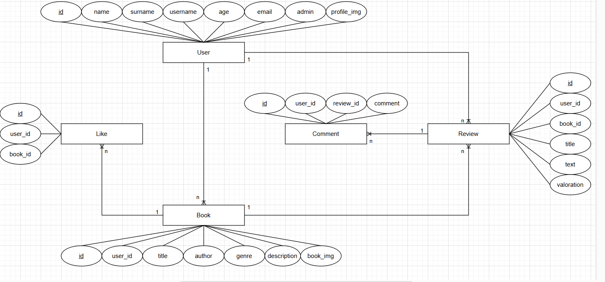

# 📚 **El Llibres**

**El Llibres** és una aplicació web dissenyada per als amants de la lectura. Proporciona una plataforma atractiva per explorar, compartir i descobrir llibres.

## Funcionalitats destacades:

-   **L'usuari pot**:

    -   Penjar llibres que hagi llegit per compartir-los amb altres usuaris.
    -   Crear ressenyes per a llibres propis o per a llibres publicats per altres usuaris.
    -   Fer comentaris en les ressenyes d'altres lectors.

-   **L'administrador pot**:
    -   Gestionar tots els llibres, usuaris i ressenyes que hi ha a l'aplicació.
    -   Afegir nous llibres i usuaris.
    -   Eliminar llibres, usuaris i ressenyes innecessàries.

En resum, **El Llibres** vol ser un espai per a la comunitat lectora on compartir opinions, recomanacions i descobrir noves lectures.

## Diagrama E/R

## Link Video

https://youtu.be/uW-FiHax-Ys
